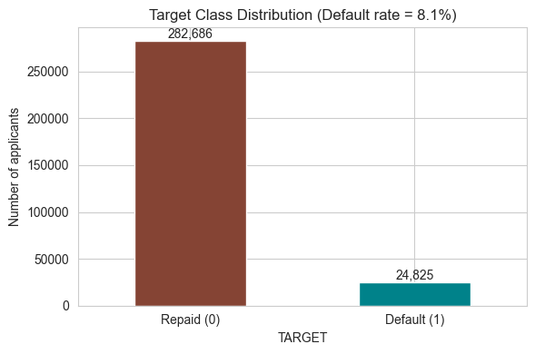
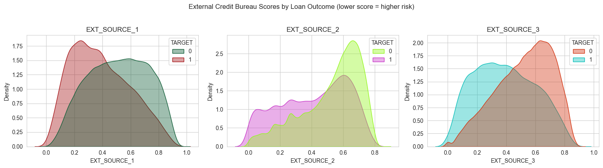
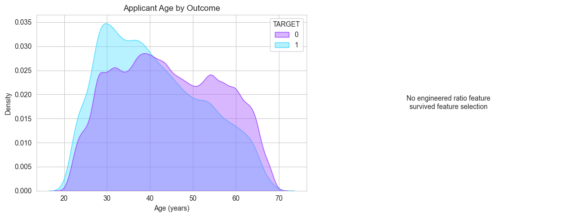
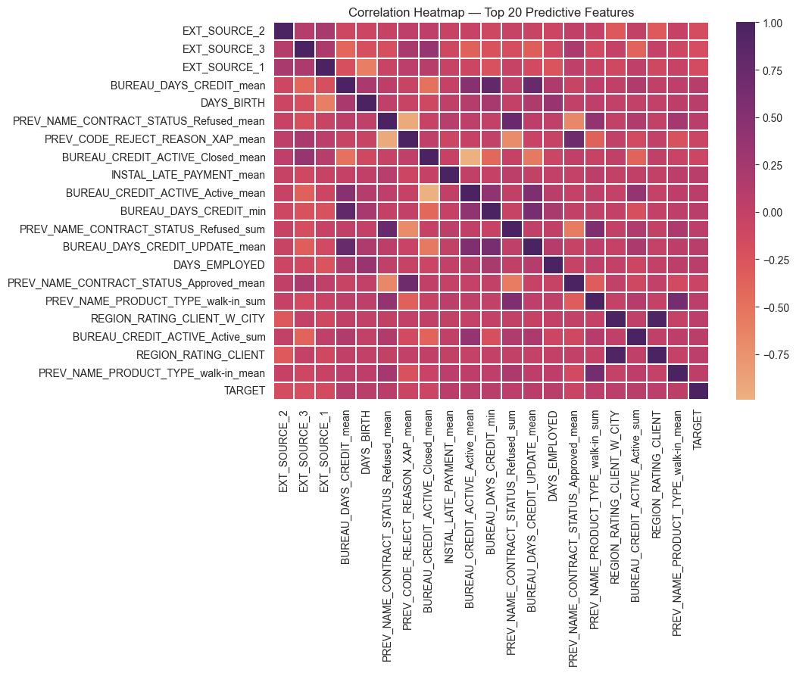
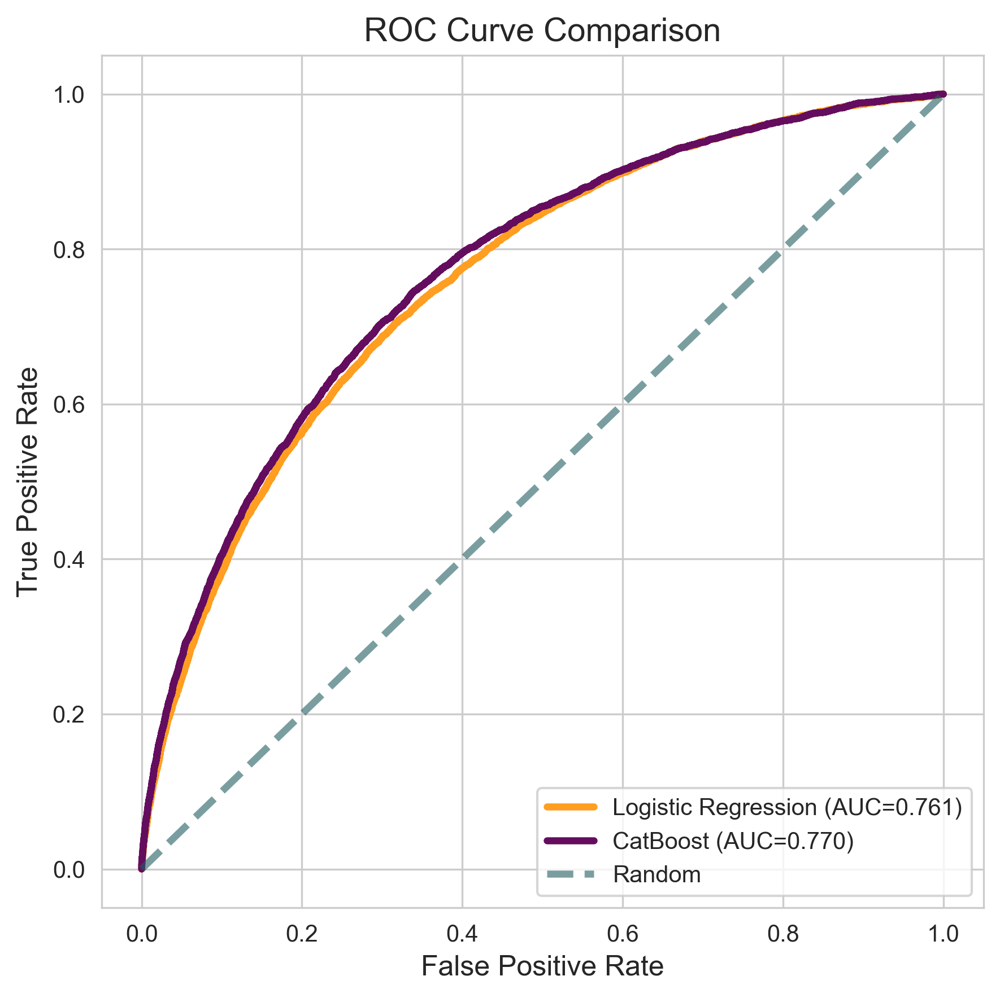
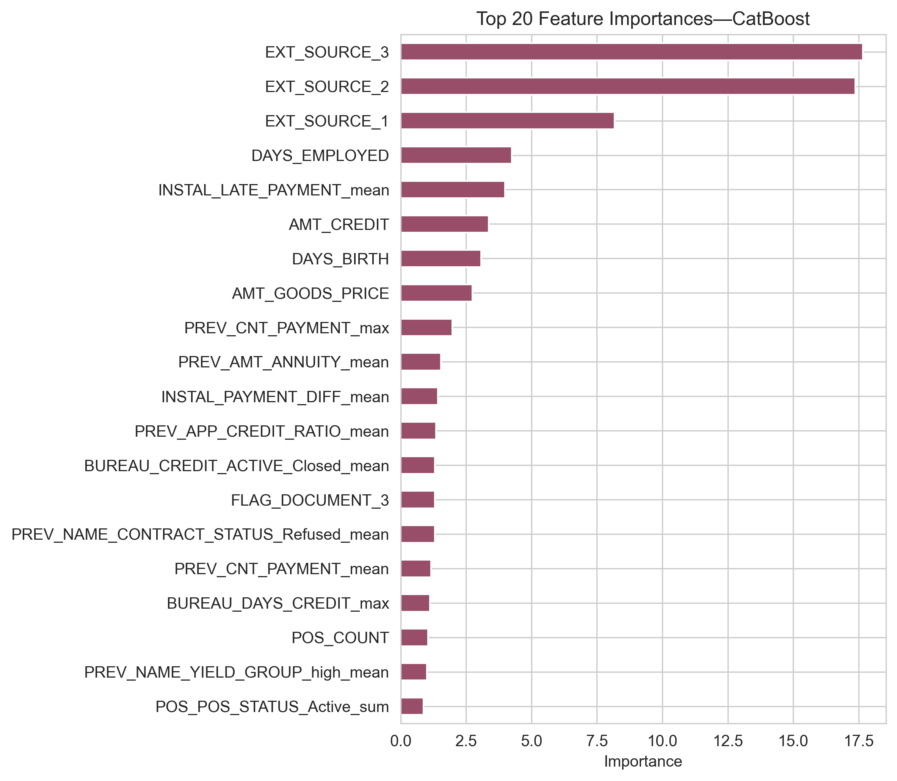
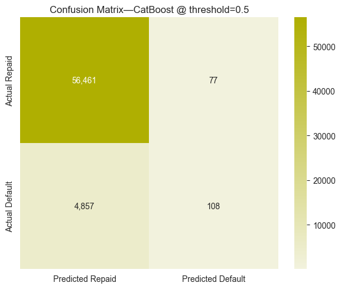
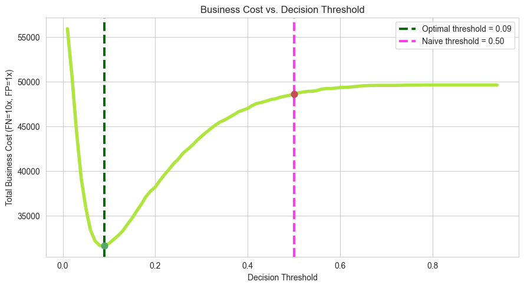
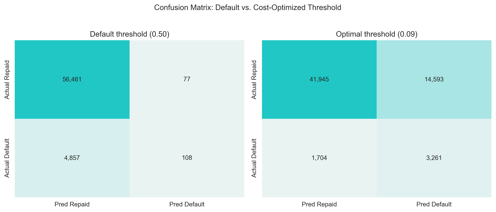

# Loan Default Risk with Business Cost Optimization

Predicting loan default probability on the Home Credit Default Risk dataset and optimizing the
classification decision threshold using a business cost framework rather than the default 0.5
statistical threshold to minimize the real-world financial cost of lending decisions.

---

## 1. Objective

Financial institutions face an asymmetric cost trade-off when approving loans:
- Approving a loan that later **defaults** → the bank loses the outstanding principal + interest (large loss).
- Rejecting an applicant who would have **repaid** → the bank only loses the foregone interest margin (smaller loss).

A model tuned purely for accuracy/AUC and evaluated at the default 0.5 probability threshold ignores
this asymmetry. This project:
1. Builds a binary classifier to predict `TARGET = 1` (client will default).
2. Engineers features from the applicant's credit bureau history, past loan applications, and repayment behavior.
3. Defines explicit business costs for False Positives and False Negatives.
4. Find the probability threshold that **minimizes total business cost**.
5. Quantifies the financial benefit of cost-based thresholding vs. the naive 0.5 cutoff.

---

## 2. Project Structure

```
Loan-Default-Risk-with-Business-Cost-Optimization/
│
├── README.md
├── Loan_Default_Risk_Cost_Optimization.ipynb     # Main analysis notebook
│
└── Loan_Default_Cost_Optimization/
    └── Images/
        ├── Fig1_target_class_distribution.png
        ├── Fig2_external_credit_bureau_scores.png
        ├── Fig3_applicant_age_outcome.png
        ├── Fig4_correlation_heatmap.png
        ├── Fig5_ROC_Curve_comparison.png
        ├── Fig6_top_20_feature_importance.png
        ├── Fig7_Confusion_Matrix_CatBoost.png
        ├── Fig8_Businesscost_decision_threshold.png
        └── Fig9_confusionmatrix_default_costoptimized.png
```

> **Note:** the raw dataset CSVs are not included in this repository due to size (~2.5 GB). See
> [How to Run](#8-how-to-run) for download instructions.

---

## 3. Dataset Overview

**Source:** [Home Credit Default Risk](https://www.kaggle.com/c/home-credit-default-risk) (Kaggle)

The dataset is relational, spread across 6 files linked by `SK_ID_CURR` (client ID):

| Table | Rows | Columns | Description |
|---|---:|---:|---|
| `application_train.csv` | 307,511 | 122 | Main table one row per loan application, with `TARGET` label |
| `application_test.csv` | 48,744 | 121 | Same schema, unlabeled (holdout) |
| `bureau.csv` | 1,716,428 | 17 | Client's credit history at other financial institutions |
| `bureau_balance.csv` | 27,299,925 | 3 | Monthly status of each external bureau credit |
| `previous_application.csv` | 1,670,214 | 37 | Client's previous applications with Home Credit |
| `POS_CASH_balance.csv` | 10,001,358 | 8 | Monthly POS/cash loan balances |
| `installments_payments.csv` | 13,605,401 | 8 | Installment-level repayment history |
| `credit_card_balance.csv` | 3,840,312 | 23 | Monthly credit card balance snapshots |

**Class balance:** the target is highly imbalanced **8.07% default rate** (24,825 defaults out of
307,511 applications), which directly motivates the cost-sensitive threshold approach used in this project.

---

## 4. Technical Approach

**4.1 Feature Engineering**
Each supplementary table (grain: multiple rows per client) was aggregated to one row per `SK_ID_CURR`
using statistics (mean, min, max, sum, count) after one-hot encoding categorical columns:
- `bureau_balance` → aggregated to `SK_ID_BUREAU`, then merged into `bureau` → aggregated to `SK_ID_CURR` (172 features)
- `previous_application` → aggregated to `SK_ID_CURR` (368 features)
- `POS_CASH_balance`, `installments_payments`, `credit_card_balance` → each aggregated to `SK_ID_CURR` (35 / 34 / 76 features)

All aggregates were merged with the main application table into a **809-column master dataset**
(356,255 rows = train + test).

**4.2 Data Cleaning**
- `DAYS_EMPLOYED` placeholder value `365243` (~1000 years, used for unemployed/retired clients) was replaced with `NaN` + anomaly flag.
- Domain ratio features added: `CREDIT_INCOME_RATIO`, `ANNUITY_INCOME_RATIO`, `CREDIT_TERM`, `DAYS_EMPLOYED_BIRTH_RATIO`, `INCOME_PER_PERSON`.
- Columns with **>70% missing values** dropped (84 columns).

**4.3 Feature Selection**
From the remaining ~725 columns, the **top 150 features** were selected by absolute Pearson correlation
with `TARGET` (computed on the training rows only) to keep the modeling dataset tractable.

**4.4 Modeling**
Two binary classifiers were trained on an 80/20 stratified train/validation split:
- **Logistic Regression** median imputation + standard scaling, `class_weight='balanced'`.
- **CatBoost** gradient-boosted trees, handles missing values natively, 300 iterations.

**4.5 Business Cost Optimization**
Illustrative cost weights were defined:
- **False Negative** (approve a defaulter) = **10 units** loss of principal + interest.
- **False Positive** (reject a good customer) = **1 unit** foregone profit margin.

The decision threshold was swept from 0.01 to 0.95, and the value minimizing `10×FN + 1×FP` on the
validation set was selected as the operating threshold.

> These cost weights are assumptions for demonstration. In production, they should be derived from actual
> average loan size, recovery rates, and interest margins.

---

## 5. Model Performance

| Model | Validation ROC-AUC |
|---|---:|
| Logistic Regression | 0.7606 |
| **CatBoost** | **0.7700** |

**CatBoost @ default 0.5 threshold:**

| | Precision | Recall | F1 |
|---|---:|---:|---:|
| Repaid | 0.92 | 1.00 | 0.96 |
| Default | 0.58 | 0.02 | 0.04 |

At 0.5, the model seldom flags a default (recall = 2%) it optimizes for overall accuracy (92%)
by essentially predicting "repaid" for nearly everyone, which is exactly the blind spot that cost-based
thresholding is designed to fix.

**CatBoost @ cost-optimized threshold (0.09):**

| | Precision | Recall | F1 |
|---|---:|---:|---:|
| Repaid | 0.96 | 0.74 | 0.84 |
| Default | 0.18 | 0.66 | 0.29 |

Recall on the default class jumps from 2% → 66%, at the cost of more false positives (more good
applicants declined) a deliberate, quantified trade-off that reduces total business cost.

---

## 6. Visualizations

1. **Target class distribution** 

2. **External credit bureau scores by outcome** 
   
3. **Applicant age by outcome** 

4. **Correlation heatmap — top 20 features**  

5. **ROC curve — LR vs CatBoost** 

6. **Top 20 feature importances (CatBoost)**  

7. **Confusion matrix @ 0.5 threshold**  

8.**Business cost vs. decision threshold**  

9. **Confusion matrix: default vs. cost-optimized threshold**  

---

## 7. Key Findings and Recommendations

**Findings:**
- The three external bureau risk scores (`EXT_SOURCE_1/2/3`) are by far the strongest predictors of
  default consistent with their purpose as third-party credit risk indicators.
- Engineered aggregates from credit bureau history (`BUREAU_DAYS_CREDIT_mean`), prior Home Credit
  rejection history (`PREV_NAME_CONTRACT_STATUS_Refused_mean`), and late-payment behavior
  (`INSTAL_LATE_PAYMENT_mean`) also rank in the top 10 features: credit history depth and repayment
  discipline matter as much as static demographic/income fields.
- CatBoost only modestly outperforms Logistic Regression (AUC 0.77 vs 0.76), suggesting most of the
  predictive signal in this feature set is close to linear.
- **The 0.5 threshold is a poor operating point for this problem**: it catches only 2% of actual
  defaulters. Moving to the cost-optimized threshold (0.09) raised default recall to 66% and reduced
  total business cost by **35.0%** (from 48,647 to 31,633 cost units) on the validation set.

**Recommendations:**
- Replace the illustrative 10:1 cost ratio with real figures (average loan size, recovery rate on
  defaults, net interest margin) before any production use.
- Re-derive the optimal threshold periodically (e.g. quarterly) as the bank's risk appetite or cost
  structure changes — it is a business decision, not a fixed model property.
- Validate the chosen threshold with k-fold cross-validation rather than a single train/validation split
  before deployment.
- Consider a full hyperparameter search and SHAP-based feature selection to push AUC beyond 0.77.

---

## 8. How to Run

**Requirements:** Python 3.10–3.13, ~4 GB free RAM, ~3 GB free disk space.

```bash
pip install pandas numpy scikit-learn catboost matplotlib seaborn pyarrow jupyter
```

**Dataset:** Download the 10 CSV files from the
[Home Credit Default Risk Kaggle competition](https://www.kaggle.com/c/home-credit-default-risk/data)
and place them in a local folder, e.g. `C:\Users\<you>\Downloads\home-credit-default-risk`.

**Run the notebook:**
1. Open `Loan_Default_Risk_Cost_Optimization.ipynb` in Jupyter.
2. Update the `DATA` variable in the first code cell to point to your dataset folder.
3. Run all cells sequentially (`Kernel → Restart & Run All`). Full execution, including feature
   aggregation across all 6 supplementary tables, takes roughly 5–15 minutes depending on hardware.

---

## 9. Skills Demonstrated

- Binary classification modeling (Logistic Regression, CatBoost / gradient boosting)
- Relational data aggregation and feature engineering across multiple linked tables
- Handling class imbalance and missing data in real-world tabular data
- Cost-based evaluation metrics and business-driven threshold optimization
- Risk modeling and probability-based scoring
- Feature importance analysis and model interpretability
- Exploratory data analysis and data visualization (Matplotlib, Seaborn)
- Memory-efficient processing of large-scale (multi-GB) datasets
